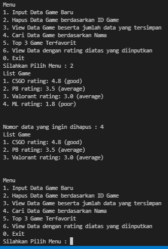
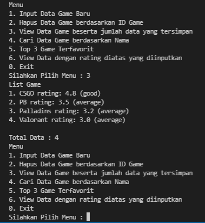
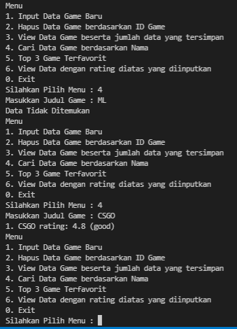
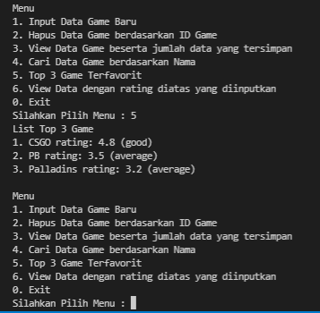
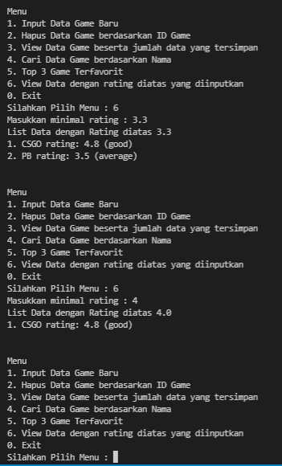

# Berikut hasil running program dari Tugas 6

## Menu 1 - Menginputkan data game pada list/array 

## Menu 2 - Menghapus data game berdasarkan ID Game yang diinputkan

## Menu 3 - Menampilkan semua data yang ada pada list/array serta menampilkan jumlah data yang tersimpan pada list/array tersebut

## Menu 4 - Mencari data game berdasarkan nama yang diinputkan

## Menu 5 - Menampilkan 3 teratas game berdasarkan rating

## Menu 6 - Menampilkan data game sesuai dengan rating minimal yang diinputkan
